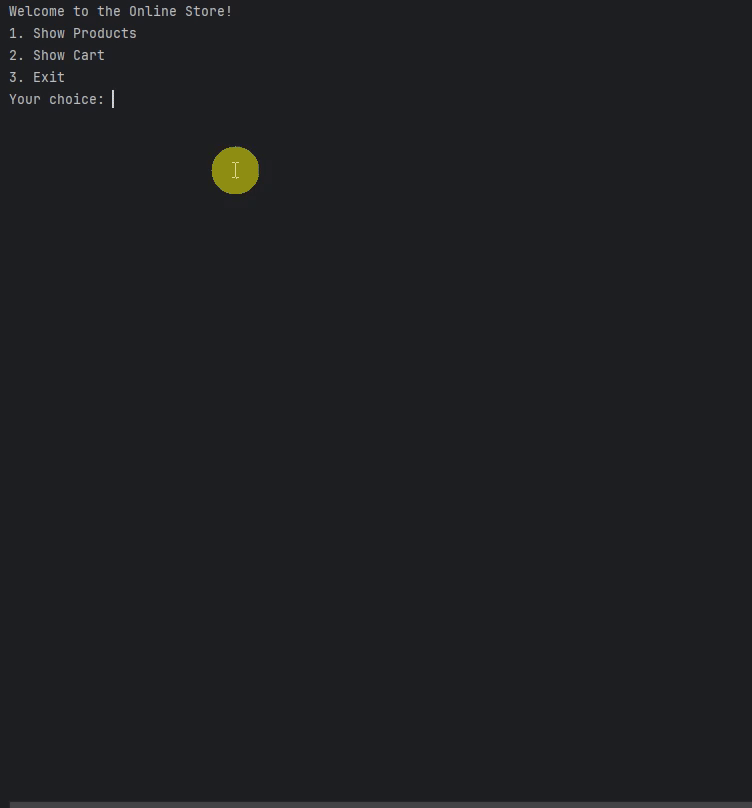
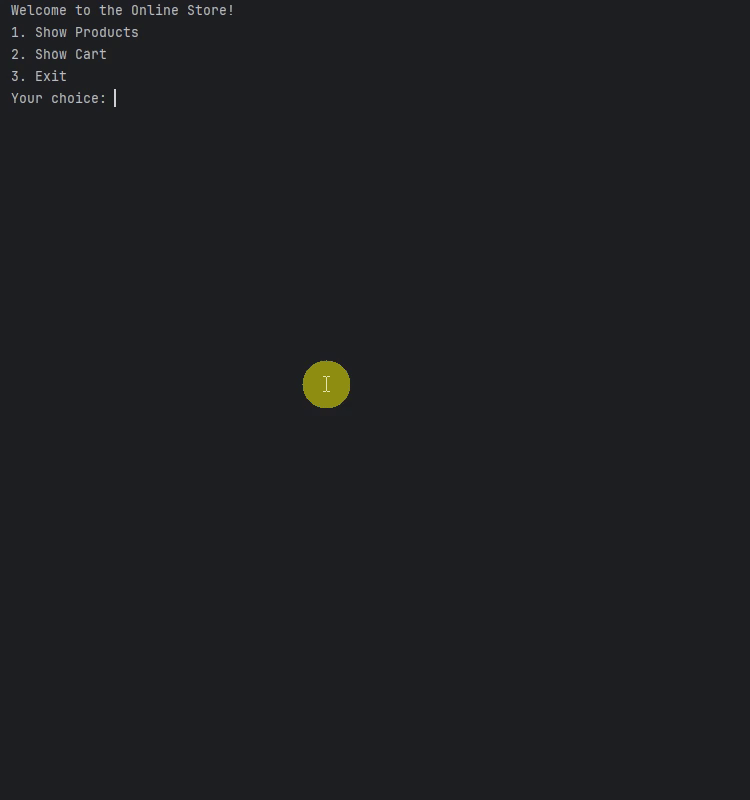
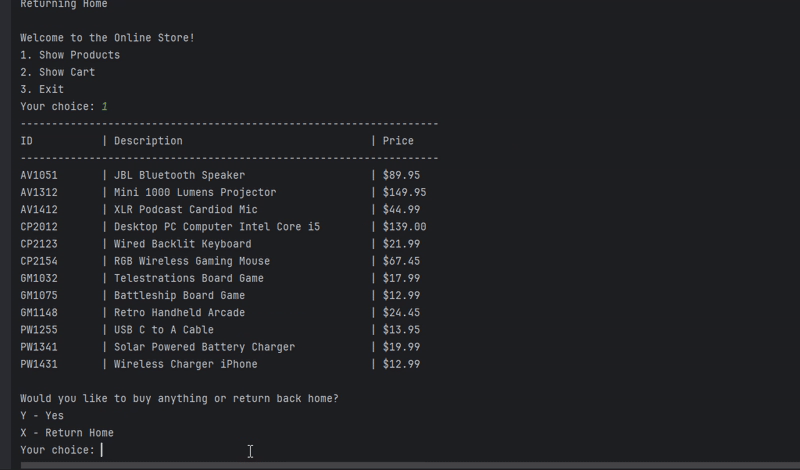

# Online Store

## Description of the Project

This command-line application simulates a complete online shopping experience. 
Users can browse a product inventory loaded from a CSV file, add items to their shopping cart, view their cart with automatic quantity grouping, and complete purchases with a full checkout process including payment handling and receipt generation.

## User Stories

- As a developer, I want to display a formatted header for users so they have the same user interface each time.
- As a user, I want to view the product catalog so that I may browse what I want to buy.
- As a developer, I want to load the products from the CSV file on startup so that users can browse available items.
- As a developer, I want to create a helper method so I can look up products reliably each time.
- As a user, I want to be able to see all the items in my cart so that I can see my running total and what is in my cart.
- As a user, I want to checkout my items so I can take the items home.
- As a user, I want to see a detailed receipt after purchase, so that I have a record of my transaction.

## Setup

Instructions on how to set up and run the project using IntelliJ IDEA.

### Prerequisites

- IntelliJ IDEA: Ensure you have IntelliJ IDEA installed, which you can download from [here](https://www.jetbrains.com/idea/download/).
- Java SDK: Make sure Java SDK is installed and configured in IntelliJ.

### Running the Application in IntelliJ

Follow these steps to get your application running within IntelliJ IDEA:

1. Open IntelliJ IDEA.
2. Select "Open" and navigate to the directory where you cloned or downloaded the project.
3. After the project opens, wait for IntelliJ to index the files and set up the project.
4. Find the main class with the `public static void main(String[] args)` method.
5. Right-click on the file and select 'Run 'YourMainClassName.main()'' to start the application.

## Technologies Used
- Java 17 (Amazon Corretto distribution)
  - `openjdk 17.0.12 2024-07-16`
## Demo
The main menu presents three options: viewing products, checking the cart, or exiting the application.

Products are displayed in a formatted table showing ID, description, and price. Users can add items to their cart by entering the product ID.

The checkout screen shows cart items with grouped quantities, accepts payment, calculates change, and displays a detailed receipt.

## Future Work

- Remove items from cart: Allow customers to remove products before checkout
- Search and filter products: Add ability to search by product name or filter by price range
- Save receipts to file: Implement the bonus feature to save receipts as timestamped text files in a Receipts folder

## Resources
- [HashMaps](https://www.w3schools.com/java/ref_hashmap_getordefault.asp)

## Thanks

Express gratitude towards those who provided help, guidance, or resources:
- Thank you to Raymond for continuous support and guidance.

